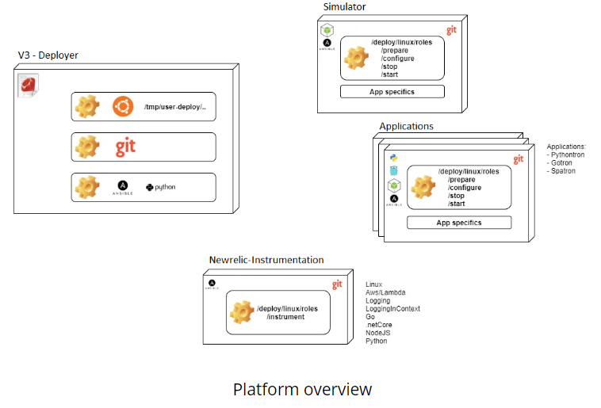
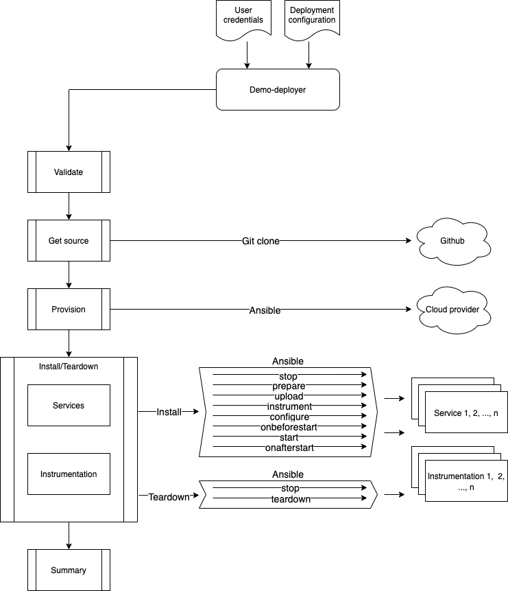

# Developer

The deployer is part of a `demo` ecosystem, sometimes referenced as `V3`.

Each component can plug with the deployer through a set of Ansible plays which the deployer leverages and invokes. Specific data between resources and services is marshalled as needed.



## Contents
* [Life cycle](#life-cycle)
* [Ansible contract](#ansible-contract)
* [Prerequisities](#prerequisites)
* [Ansible installation](#ansible-installation)
* [Application defaults](#application-defaults)
* [Running tests](#running-tests)
* [Batch execution](#batch-execution)


## Life cycle

While running, the deployer goes through several steps (shown in Figure 2.) I have outlined them below with a short description.

* Validate
	* Various checks to ensure the user credential and deployment configuration have all the required values.
* Get source
	* Retrieve the repositories for all services and instrumentation referenced in the deployment configuration.
* Provision
	* Create cloud resources in AWS, Azure, or GCP using Ansible.
	* These resources are created in **sequence**.
* Install/Teardown
	* Handles installing, starting, and tearing down services and instrumentations.
	* The relationship between the deployer and a service/instrumentation is the Ansible contract they share. For more information on the contract, see [Ansible contract](#ansible-contract).
	* These services/instrumentations are created in **parallel**. 
* Summary
	* Output including IP addresses, URLs, instrumentation, and any other information pertinent to the deployment.

  

*Figure 2. Deployer Life Cycle*

## Ansible contract

The deployment process of a service or instrumentation is a set of self defined Ansible roles. They live with the code, stored in a top level `deploy/<operating system>/roles` directory. Ex: `deploy/linux/roles`. The deployer handles passing values to and executing these Ansible plays. There are 8 plays called during installation and 2 called during teardown.

Each of these plays are run in sequence from top to bottom. If a play is not provided, the deployer will silently skip it. Those marked as `parallel` run the play for all services/instrumentations at the same time. Those marked as `serial` run the play for all services/instrumentations one at a time.

#### Installation
* stop - parallel
* prepare - serial
* upload - parallel
* instrument - serial
* configure - serial
* onbeforestart - serial
* start - parallel
* onafterstart - serial

#### Teardown
* stop - parallel
* teardown - serial

The deployer does not care about the contents of these plays. For example, the steps to start a service could be located in the `configure` Ansible play. However, please place steps in the plays that correspond to what they are doing. This will help with any future debugging.

## Prerequisites

To run the deployer locally, you'll want to install the dependencies below. Note, you may also refer to the root [Dockerfile](../../Dockerfile) to see an example on a Linux Ubuntu image.

* Ruby v2.5 or above
* Bundler, you may need to install a specific version with "gem i bundler -v 1.17.3" in order to successfuly run "sudo bundle install" in the deployer directory
* Git
* Python3
* Terraform
* Ansible v2.8 or above. See the ansible installation steps below.
* Cloud provider account and credentials, more info can be found at [UserConfig](../user_config/README.md)
* For Azure, ```pip install 'ansible[azure]' packaging msrestazure```
* For GCP, ```ansible-galaxy collection install google.cloud```
* For NewRelic, ```ansible-galaxy install newrelic.newrelic_java_agent```

## Ansible installation
Ansible should be installed through pip to ensure the proper installation and configuration with Python.
More information can be found [here](https://docs.ansible.com/ansible/latest/installation_guide/intro_installation.html#latest-releases-via-pip).

Once Ansible is installed, check which version of Python Ansible uses (it should be python3) `ansible --version`

```
  ansible 2.8.0
  config file = None
  configured module search path = ['/home/jerard/.ansible/plugins/modules', '/usr/share/ansible/plugins/modules']
  ansible python module location = /home/jerard/.local/lib/python3.6/site-packages/ansible
  executable location = /home/jerard/.local/bin/ansible
  python version = 3.6.7 (default, Oct 22 2018, 11:32:17) [GCC 8.2.0]
```

### Reinstall Ansible using PIP
Sometimes the association of Ansible and Python might not be right, so to ensure that they are in sync, you can install ansible with PIP.
Simply use the following command (leave out `==2.8.0` if installing latest)

`pip install ansible==2.8.0`

Boto3, botocore and boto are required as well.  Note they should not be installed as "sudo" but as the current user.
* `python3 -m pip install --upgrade setuptools --user`
* `python3 -m pip install boto3 --user`
* `python3 -m pip install botocore --user`
* `python3 -m pip install boto --user`

In addition some aws/lambda dependencies on s3 require python2 and the following:
* `sudo yum install python27 -y`
* `sudo yum install python-pip -y`
* `python2 -m pip install --upgrade setuptools --user`
* `python2 -m pip install boto3 --user`
* `python2 -m pip install botocore --user`
* `python2 -m pip install boto --user`

## Application Defaults

The deployer default configuration is defined in [app_config.yml](../../src/app_config.yml).

If needed you can define local override of those configuration options. To do so create a file named `app_config.yml.local` in the same `src/config` folder.

You can then add any specific override in this file. It is not necessary to have the entire `app_config.yml` file copied, but only represent the key/value pair you wish to override.

Note, while it is possible to alter some of the deployer configuration, changing some of those could break the execution of certain deployer steps.

## Running Tests

### UnitTests

The deployer unit tests are implemented with Rake. to run them simply execute the following:

```
sudo bundle install
rake
```

### Integration and UserAcceptanceTests

We also use Rake to execute the integration and user acceptance tests (UATs).
To run those locally, you'll want to update the [UAT user config file](../../user_acceptance_tests/uatuser.json) with your own user credentials.
Then you can run any of the below commands to run the associated tests:

```
rake test:uat:integration
rake test:uat:aws
rake test:uat:azure
```

### Trons definition

A `Tron` is type of application that can be deployed with the `demo-deployer` for the purpose of a particular demo. It's typically a lightweight service, with the below APIs:
* /api/inventory
* /api/inventory/[1-10]
* /api/validateMessage?message=[xxx]

Current Trons
* [Nodetron](https://github.com/newrelic/demo-nodetron)

Each `Tron` can have various behavior defined.

#### Tron Behaviors

Each tron support the execution of [behaviors](behaviors/README.md).

## Batch execution

The Deployer can also be run in batch. This could be useful to deploy a same configuration to multiple users at once, or deploy and teardown multiple deploy configurations at once (for the purpose of testing for example).

Here are a few examples:

* Deploy and Teardown afterward (ignoring any errors)
```bash
docker run -it -v $HOME/configs/:/mnt/deployer/configs/ -v $HOME/myproject/test/definitions/:/mnt/deployer/definitions/ --entrypoint ruby deployer batch.rb -c /mnt/deployer/configs/jerard.docker.local.json -d definitions -s 15 -l debug -m deploy,teardown -i
```

* Teardown first followed by a deploy to multiple user configs, then another teardown attempt to clean the environment
```bash
docker run -it -v $HOME/configs/allusers/:/mnt/deployer/allusersconfigs/ -v $HOME/myproject/deploy/:/mnt/deployer/deploy/ --entrypoint ruby deployer batch.rb -c /mnt/deployer/allusersconfigs/ -d /mnt/deployer/deploy/hello.json -s 15 -l debug -m teardown,deploy,teardown -i
```
