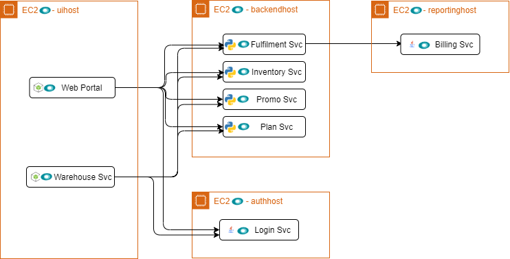

# Acme Telco Lite

Welcome to Acme Telco Lite, a telecom business which has an eCommerce website for its customers. Telco Lite is powered by a microservice architecture.

## Application Design

Acme Telco Lite has 8 services, plus a simulator:

* Web Portal
* Warehouse Portal
* Promo Service
* Login Service
* Inventory Service
* Plan Service
* Fulfillment Service
* Billing Service

The simulator is not part of the Telco Lite infrastructure, but it is part of the demo deployment. It runs scenarios against the application to create web traffic and generate interesting data in New Relic.

## Architecture

## Story

In this story, you deploy Telco Lite and use New Relic to investigate issues. At the end, you'll tear down the infrastructure you created to tidy up your cloud resources.

Your first step is to [set up](prereqs.md) your environment so that you'll be ready to deploy the services.