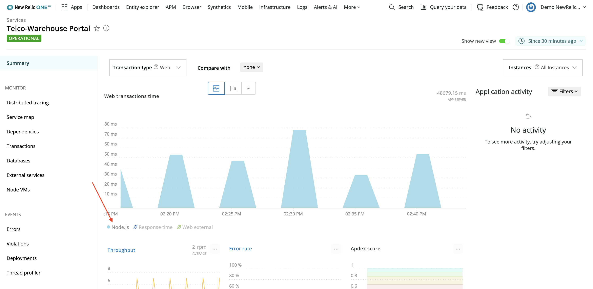
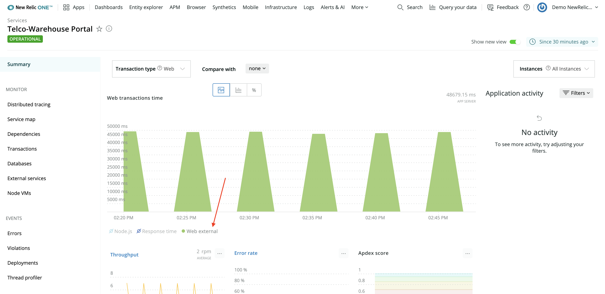
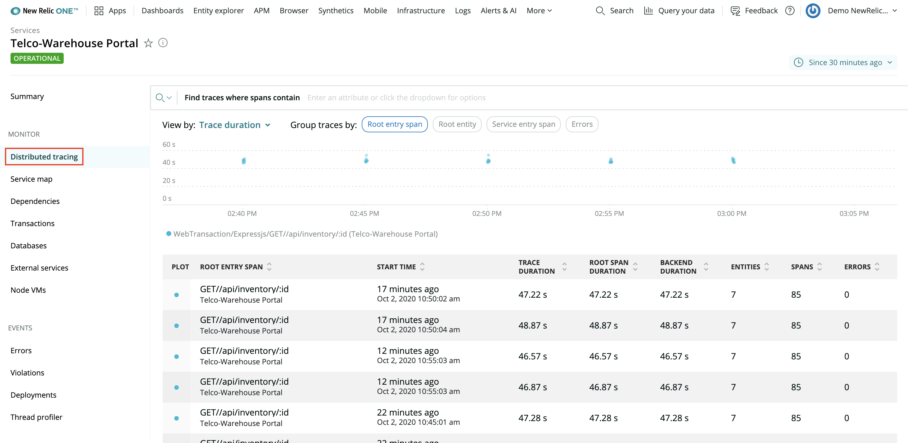
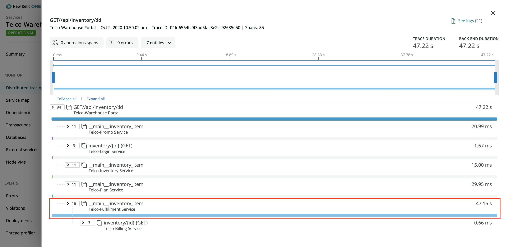
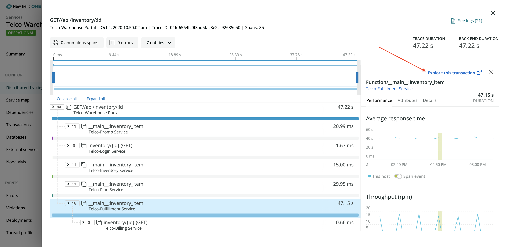
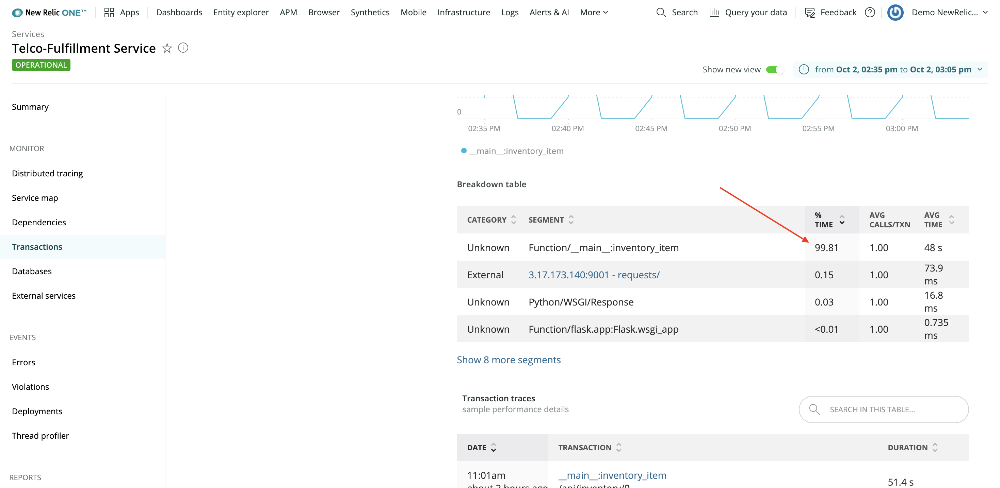
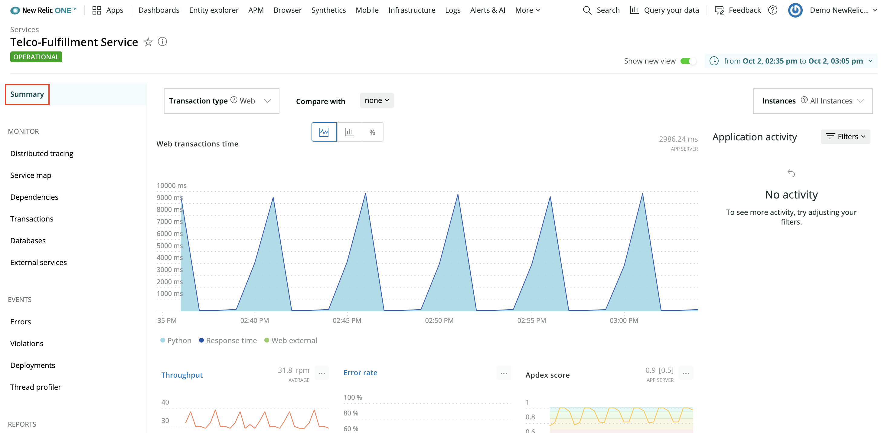

# User story: CPU spike

You're a developer working on Telco Lite and you've been paged about high response times in the Warehouse Portal. It's time to open up New Relic, uncover the source of the problem, and save the day.

## Prerequisites

This user story assumes you're familiar with the [infrastructure of Telco Lite](README.md#application-design), you've [set up your local environment](prereqs.md), and you've [deployed and instrumented the Telco Lite services](deployment.md).

## Start with APM

To begin, log into [New Relic One](one.newrelic.com) and select **APM** from the top navigation menu. Here, you see an overview of all eight Telco Lite services, including the service names, response times, and throughputs. Notice that the response time for **Telco-Warehouse Portal** is unusually high:

Select the **Telco-Warehouse Portal** service name from the APM overview to see a summary of that service. The top graph in the summary view shows **Web transactions time**:

You see several peaks, reaching almost 50,000 milliseconds—or 50 seconds! From this graph, you can actually gain a little more insight by toggling the colored components beneath the graph. For example, select **Node.js**:

The graph changed to show only what the Node.js component contributes to the overall response time: less than 100 ms, in this example. Now, select **Web external** and deselect **Node.js**:

You can see that external web traffic is the primary contributor to the high response times. That's a good start, but "external web traffic" is vague and unhelpful. Next, you'll dive deeper into the specifics of what makes up that component.

## Move to distributed tracing

So, you know that **Web external** is the culprit of the high response times, but it's hard to tell why. External web traffic is all the requests made from your service to other services. This means you should look into what external requests that the warehouse portal makes to try to understand exactly what external service is the bottleneck.

Select **Monitor > Distributed tracing** from the left-hand navigation:

This view shows you requests to the warehouse portal. Select a request from the table at the bottom of the view to see a trace through that request:

From this trace, you can learn that one external request contributes almost all of the total trace duration. Specifically, an external request to the **Telco-Fulfillment Service** contributes over 99% of the overall response time.

This is good news! You own the fulfillment service, which means you can drill down for even more information. Select the offending row (called a span), and then select **Explore this transaction**:

## Explore a transaction

You're now looking at the `__main__:inventory_item` transaction overview. Because you know that some part of this transaction is slow, you can use this transaction overview to narrow your focus even further.

Similar to how you modified the warehouse portal APM graph, you can look specifically at the components of this transaction to understand where the root cause of the slowness is. Another way to view this information is to scroll down to the **Breakdown table** in that same view:

Here, you see that the segment `Function/__main__:inventory_item`, a Python function, contributes over 99% of the overall response time.

At this point, you know that **Telco-Warehouse Portal** is slow because it makes an external request to **Telco-Fulfillment Service**, which is slow. You also know that the issue in the fulfillment service is local because 99+% of the request is spent in Python code, not external services. Take a step back to the fulfillment service's summary page to look at the service as a whole, instead of this single transaction:

## Search the service summary

Scroll down on this view to familiarize yourself with the graphs it shows, such as **Throughput** and **Error rate**. At the bottom of the page, you can see a table with the fulfillment hosts. You can't currently drill into a specific host in the new UI (we're working on it), but you can in the old UI. Toggle **Show new view** to "off" and select the host link:

## Examine infrastructure

Now, you're looking at graphs in the infrastructure view for that service's host. Notice that the CPU % has a lot of high spikes. Click and drag on the graph from the start of a spike to the end of it to narrow the time scale to the period when CPU utilization goes up:

If you compare this graph to the fulfillment service's transaction graph you looked at earlier, you'll see that soon after `__main__:inventory_item` begins executing, the CPU utilization of the host sharply rises to 100%!

## Conclusion

At the end of your investigation, you discovered:

- **Telco-Warehouse Portal** is slow because it makes an external request to **Telco-Fulfillment Service**, which is slow
- The fulfillment service's Python function contributes over 99% of the response time
- Soon after the Python function starts executing, the host's CPU utilization spikes up to 100%

Now, as the developer behind the fulfillment service, you have enough information to debug the issue causing the CPU spikes. Congratulations!

You can learn more about using New Relic by walking through [other stories](deployment.md#user-stories). If this is your last story, you can [tear down](deployment.md#tear-down-telco-lite) all the Telco Lite services.